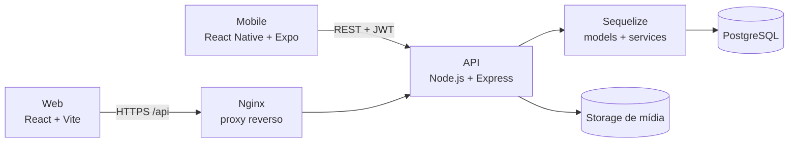

<div align="center">

# Nexus Full

### Uma plataforma de jogos. Duas experiências. Um único ecossistema.

E-commerce full stack com aplicações **Web** e **Mobile**, API REST compartilhada,
autenticação JWT, checkout, entrega de keys e painel administrativo.

<p>
  
  
  
  
  
  
</p>

</div>


<!-- TODO(MANUAL): CAPA WEB + MOBILE
Crie uma composição 1600x900 e salve em:
docs/images/readme/nexus-multiplatform.webp

Composição sugerida:
- screenshot web da Home ocupando o fundo/esquerda;
- screenshot mobile da Home no centro-direita;
- screenshot mobile da Loja parcialmente sobreposto à direita;
- fundo escuro, sem textos extras e usando o mesmo usuário/jogos nas telas.

Depois substitua a imagem acima por:

-->

> **Status:** em desenvolvimento. O fluxo principal de compra, a API, o banco de dados,
> as aplicações Web e Mobile, o painel administrativo e a infraestrutura Docker estão implementados.

## Visão geral

O **Nexus Full** simula uma loja digital de jogos de ponta a ponta. O usuário pode
descobrir títulos, comparar plataformas e ofertas, montar o carrinho, finalizar a
compra e acessar pedidos e keys. Administradores contam com ferramentas para operar
catálogo, estoque, promoções, pedidos e histórico de preços.

O projeto não é apenas uma interface: Web e Mobile consomem a mesma API e compartilham
as mesmas regras de negócio e dados.

<table>
  <tr>
    <td align="center"><strong>🖥️ Web</strong><br />React, Vite e Tailwind CSS</td>
    <td align="center"><strong>📱 Mobile</strong><br />React Native, Expo e Expo Router</td>
    <td align="center"><strong>⚙️ Backend</strong><br />Node.js, Express e Sequelize</td>
    <td align="center"><strong>🐘 Dados</strong><br />PostgreSQL, migrations e seeders</td>
  </tr>
</table>

## Uma API, duas experiências

| Experiência | Destaques |
| --- | --- |
| **Frontend Web** | Navegação desktop responsiva, catálogo com filtros, galeria de produto, checkout, área do usuário e administração. |
| **Frontend Mobile** | Navegação por abas, componentes adaptados para toque, armazenamento seguro da sessão e fluxos de compra e administração no celular. |
| **Backend compartilhado** | Autenticação, catálogo, listings, estoque, promoções, carrinho, checkout, pedidos, biblioteca, avaliações e upload de mídia. |

### Cobertura funcional

| Fluxo | Web | Mobile | API |
| --- | :---: | :---: | :---: |
| Cadastro, login e sessão | ✅ | ✅ | ✅ |
| Catálogo, busca e filtros | ✅ | ✅ | ✅ |
| Detalhes, galeria e plataformas | ✅ | ✅ | ✅ |
| Favoritos e carrinho | ✅ | ✅ | ✅ |
| Checkout e pedidos | ✅ | ✅ | ✅ |
| Biblioteca e entrega de keys | ✅ | ✅ | ✅ |
| Perfil e configurações | ✅ | ✅ | ✅ |
| Painel administrativo | ✅ | ✅ | ✅ |

## Produto em ação

### Descoberta e compra

<table>
  <tr>
    <td width="50%" align="center">
      
      <br /><strong>Catálogo, ofertas e filtros</strong>
    </td>
    <td width="50%" align="center">
      
      <br /><strong>Detalhes e seleção de plataforma</strong>
    </td>
  </tr>
</table>

### Pós-compra e operação

<!-- TODO(MANUAL): CAPTURA DE PEDIDOS
Refaça a captura de pedidos com todas as keys ocultas, salve em
docs/images/readme/web/pedidos.webp e troque o src da primeira imagem abaixo por
./docs/images/readme/web/pedidos.webp. Mesmo sendo dados de demonstração, a versão
mascarada comunica melhor o cuidado com informações sensíveis.
-->

<table>
  <tr>
    <td width="50%" align="center">
      
      <br /><strong>Pedidos, biblioteca e keys</strong>
    </td>
    <td width="50%" align="center">
      
      <br /><strong>Painel administrativo</strong>
    </td>
  </tr>
</table>

### Experiência mobile

A aplicação mobile leva o mesmo fluxo ao celular com navegação por abas, componentes
otimizados para toque e rotas dedicadas para loja, produto, carrinho, checkout,
favoritos, pedidos, biblioteca, perfil e administração.

<!-- TODO(MANUAL): GALERIA MOBILE
Faça as capturas no mesmo aparelho/emulador, preferencialmente em 1080x2400, sem
notificações pessoais na barra de status. Use o mesmo jogo e usuário das imagens web.

Crie a pasta docs/images/readme/mobile e adicione:
- home.webp       -> Home com ofertas e jogos em destaque
- catalogo.webp   -> Loja com produtos e filtros abertos
- produto.webp    -> Detalhes do mesmo jogo exibido na versão web
- checkout.webp   -> Resumo da compra antes da confirmação
- pedidos.webp    -> Pedidos ou biblioteca com keys ocultas
- admin.webp      -> Dashboard ou listagem administrativa

Depois, cole logo abaixo do título "Experiência mobile" este bloco:

<p align="center">
  
  &nbsp;
  
  &nbsp;
  
</p>
<p align="center">
  
  &nbsp;
  
  &nbsp;
  
</p>
-->

## Arquitetura



No backend, as responsabilidades seguem o fluxo:

```text
route → controller → service → validator/model → PostgreSQL
```

- O frontend web usa Nginx para servir o build, redirecionar HTTP para HTTPS e encaminhar `/api/` e `/media/`.
- O aplicativo Expo acessa a API pelo endereço da máquina na rede local durante o desenvolvimento.
- A API centraliza regras de autenticação, catálogo, compra, estoque, entrega e administração.
- Migrations e seeders mantêm a evolução e a carga inicial do banco reproduzíveis.

## Funcionalidades

### Loja e catálogo

- Listagem de jogos com busca, filtros, categorias e plataformas.
- Ofertas ativas e histórico de preços por listing.
- Página de produto com galeria, estoque, avaliações e escolha de plataforma.
- Favoritos, carrinho e validação de disponibilidade.

### Autenticação e conta

- Cadastro e login com JWT.
- Rotas protegidas para conta, carrinho, checkout, pedidos e favoritos.
- Limpeza automática da sessão ao receber uma resposta `401`.
- Sessão web persistida no navegador e sessão mobile protegida com SecureStore.
- Separação de permissões entre usuário e administrador.

### Checkout e biblioteca

- Criação de pedidos a partir dos itens válidos do carrinho.
- Resumo da compra e histórico de pedidos.
- Entrega e visualização protegida das keys adquiridas.
- Biblioteca do usuário disponível na experiência mobile.

### Administração

- CRUD de jogos, categorias e plataformas.
- Listings, estoque e mídias por jogo e plataforma.
- Criação e acompanhamento de promoções.
- Consulta de pedidos e detalhes da operação.
- Auditoria do histórico de preços.

## Stack

| Camada | Tecnologias |
| --- | --- |
| **Web** | React 19, TypeScript, Vite, Tailwind CSS 4, React Router, Axios, Vitest |
| **Mobile** | React Native, Expo SDK 54, Expo Router, SecureStore, Axios |
| **Backend** | Node.js, TypeScript, Express 5, Sequelize, JWT, Multer, Jest |
| **Banco de dados** | PostgreSQL 15, migrations e seeders |
| **Infraestrutura** | Docker Compose, Nginx 1.27 Alpine, HTTPS local, proxy reverso e volumes persistentes |

## Rotas e módulos principais

| Área | Web | Mobile | Backend |
| --- | --- | --- | --- |
| Descoberta | `/`, `/loja`, `/ofertas` | Início e Loja | `/games`, `/categories`, `/platforms`, `/promotions` |
| Produto | `/loja/:gameId`, `/ofertas/:offerId` | Detalhes do jogo | `/games`, `/listings`, `/game-images`, `/reviews` |
| Conta | `/login`, `/cadastro`, `/configuracoes` | Login, Cadastro e Perfil | `/auth`, `/users` |
| Compra | `/carrinho`, `/checkout`, `/meus-pedidos` | Carrinho, Checkout, Pedidos e Biblioteca | `/cart`, `/checkout`, `/orders`, `/library`, `/delivered-keys` |
| Administração | `/admin/*` | Área administrativa protegida | `/admin`, `/game-keys`, `/history` |
| Operação | `/api/health` | Consumo da API pela rede local | `/health`, `/media` |

## Estrutura do projeto

```text
.
├── frontend/          # Aplicação web React + Vite
├── mobile/            # Aplicação React Native + Expo Router
├── backend/           # API REST Express + Sequelize
├── .docker/           # Certificados e volumes locais
├── docker-compose.yml # Orquestra banco, API, web e mobile
└── .env.example       # Referência central de configuração
```

As aplicações são independentes e não usam um workspace de monorepo. Dependências e
comandos devem ser executados dentro de `frontend/`, `mobile/` ou `backend/`.

## Como executar

### Projeto completo com Docker

Pré-requisitos: Docker, Docker Compose e uma entrada local para `nexus.store` caso
queira utilizar o domínio customizado.

```bash
# Na raiz do repositório
cp .env.example .env

# Ajuste os valores do ambiente e suba todos os serviços
docker compose up --build
```

Depois da inicialização:

| Serviço | Endereço |
| --- | --- |
| Frontend web | `https://nexus.store` ou `https://localhost` |
| API via Nginx | `https://nexus.store/api/health` |
| API direta | `http://localhost:3001/health` |
| Mobile | QR code exibido pelo serviço Expo |
| PostgreSQL | `localhost:5434` |

> No celular, `localhost` aponta para o próprio aparelho. Configure
> `EXPO_PUBLIC_API_URL` e `REACT_NATIVE_PACKAGER_HOSTNAME` no `.env` da **raiz** com o
> IP da máquina na rede local. Não crie outro `.env` dentro de `mobile/`.

<details>
<summary><strong>Executar cada aplicação separadamente</strong></summary>

### Frontend web

```bash
cd frontend
npm install
npm run dev
```

### Backend

```bash
cd backend
npm install
npm run dev
```

### Mobile com Expo Go

```bash
# O arquivo .env continua na raiz do repositório
cd mobile
npm install
npm start
```

</details>

## Qualidade e segurança

- Testes unitários com Vitest no frontend e Jest no backend.
- TypeScript nas três aplicações.
- Validação de payloads e separação da API em camadas.
- Guards de autenticação e autorização administrativa.
- Headers de segurança e HTTPS local configurados no Nginx.
- CORS configurável por ambiente e arquivos de mídia servidos por rota dedicada.
- Segredos centralizados em variáveis de ambiente; variáveis `EXPO_PUBLIC_*` são tratadas como públicas.

## Autores

Desenvolvido por **Murilo Pereira Macedo** e **Izaac Eduardo**, estudantes de
Análise e Desenvolvimento de Sistemas.
