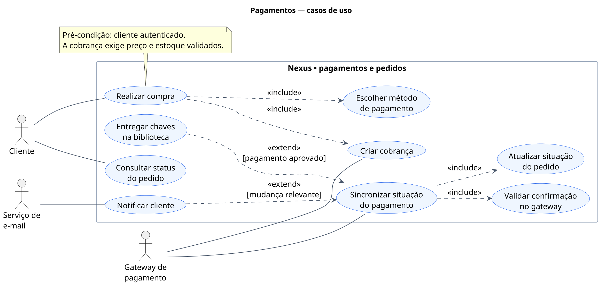
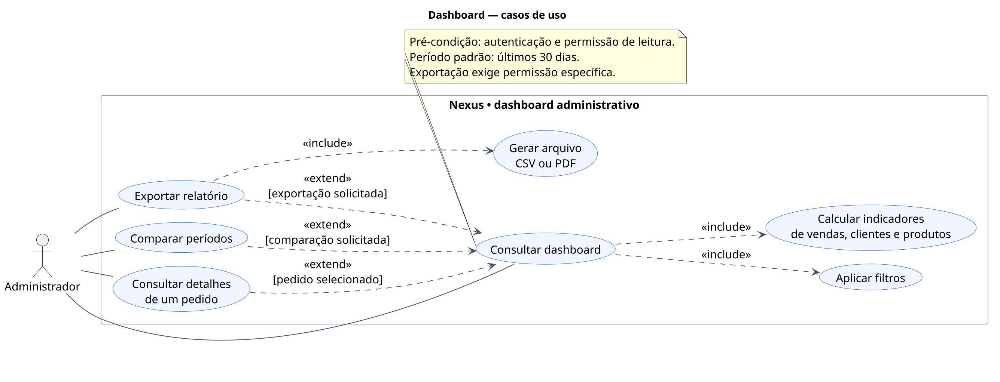
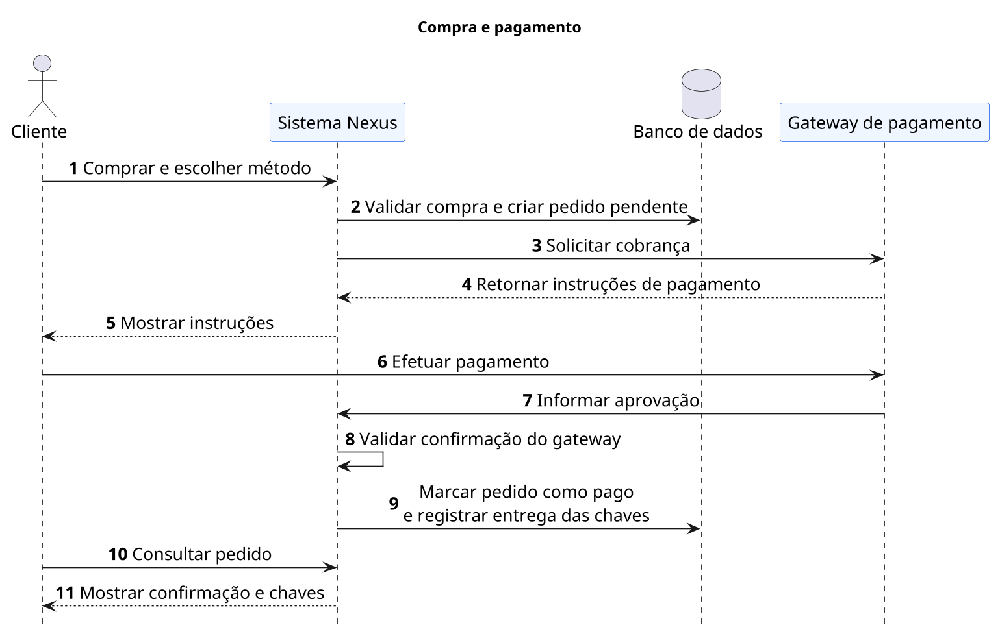
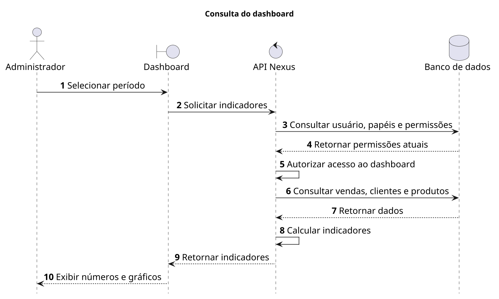
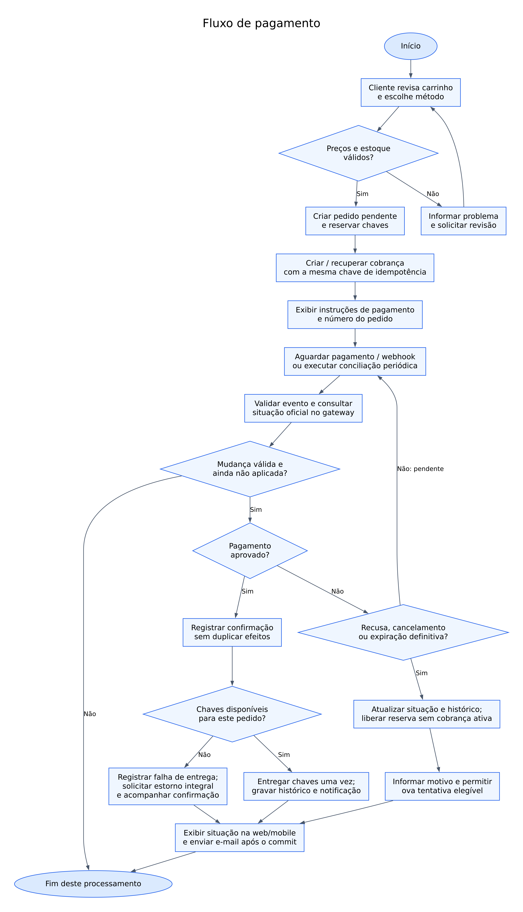
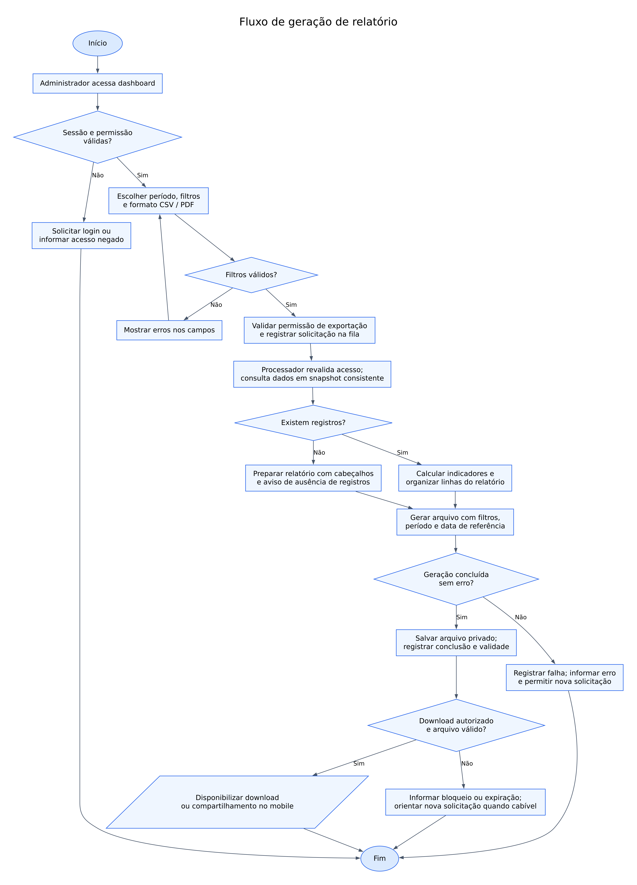

# Nexus Full — proposta de evolução

## Pagamentos, dashboard administrativo e experiência de compra

### Resumo

O Nexus Full é uma loja de chaves digitais de jogos para diferentes plataformas. Disponível na web e no aplicativo, reúne catálogo, ofertas, pedidos e uma biblioteca pessoal para acesso às chaves adquiridas.

### Por que existe

Quem joga em diferentes plataformas pode ter dificuldade para encontrar ofertas e organizar suas compras. O Nexus reúne opções em um só lugar e facilita o acesso às chaves para ativação dos jogos na plataforma escolhida.

### Por que evoluir o sistema

| Necessidade | Problema atual | Evolução proposta |
| --- | --- | --- |
| **Pagamentos funcionais** | O pedido é concluído sem uma confirmação financeira de um serviço externo, o que impede uma operação comercial completa. | Integrar um gateway para cobrar, confirmar o pagamento e liberar as chaves com segurança. |
| **Dashboard analítico** | A administração não reúne indicadores de vendas, clientes e produtos, dificultando o acompanhamento dos resultados. | Apresentar métricas e relatórios que apoiem decisões sobre ofertas, catálogo e atendimento. |

## 1. Objetivos e limites da proposta

A evolução terá quatro frentes:

- **Pagamentos:** cartão de crédito, Pix e boleto, com confirmação pelo gateway.
- **Dashboard:** indicadores, filtros, comparações e relatórios.
- **Pedidos:** histórico, observações administrativas, cancelamento e estorno integral quando permitido.
- **Experiência:** compra e acompanhamento mais claros na web e no mobile.

O Mercado Pago será a referência de integração. A proposta considera compras em reais e estorno integral; parcelamento e estorno parcial ficam fora deste escopo.

### Base técnica consultada

A análise considerou o código e a estrutura do banco definidos no projeto. O Nexus já possui usuários, jogos, ofertas, pedidos, chaves e controle de acesso administrativo. Essa base será reaproveitada para integrar os pagamentos e produzir os indicadores.

## 2. Requisitos funcionais

Os dez requisitos funcionais definem o que será acrescentado ou ampliado no sistema.

| ID | Requisito | Descrição |
| --- | --- | --- |
| **RF01** | Integração de pagamentos | Criar e consultar cobranças em um gateway, vinculadas ao pedido, sem duplicar cobranças ao repetir uma solicitação. |
| **RF02** | Métodos de pagamento | Permitir cartão de crédito, Pix e boleto, mostrando valores, instruções e prazo de pagamento. |
| **RF03** | Confirmação automática | Validar as notificações do gateway e atualizar o pedido conforme aprovação, recusa, cancelamento ou expiração. |
| **RF04** | Reserva e entrega das chaves | Reservar as chaves durante a compra e liberá-las na biblioteca após o pagamento, impedindo a venda da mesma chave a dois clientes. |
| **RF05** | Acompanhamento do pedido | Mostrar situação, itens e histórico ao comprador, permitir retomar pagamentos válidos e enviar avisos por e-mail. |
| **RF06** | Gestão administrativa | Permitir consultar pedidos, registrar observações e solicitar cancelamento ou estorno integral quando permitido, mantendo o registro das ações. |
| **RF07** | Dashboard analítico | Exibir indicadores de vendas, estornos, clientes e jogos mais vendidos. |
| **RF08** | Filtros e comparações | Filtrar resultados por período, jogo, plataforma e método de pagamento, conforme o indicador, e comparar períodos. |
| **RF09** | Relatórios | Gerar relatórios em CSV ou PDF, com os filtros selecionados e acompanhamento da geração. |
| **RF10** | Experiência de compra | Apresentar etapas, resumo da compra e mensagens claras de carregamento, sucesso ou erro, com retomada após interrupções. |

## 3. Requisitos não funcionais e indicadores

### 3.1 Requisitos não funcionais

Os cinco requisitos não funcionais estabelecem as qualidades esperadas para a evolução.

| ID | Categoria | Meta |
| --- | --- | --- |
| **RNF01** | Desempenho | Suportar 100 usuários simultâneos. Em 95% das consultas, responder em até 2 segundos nas operações comuns e 3 segundos no dashboard, desconsiderando o tempo do gateway. |
| **RNF02** | Segurança | Usar HTTPS, verificar acesso aos pedidos e permissões administrativas na API e deixar os dados de cartão sob responsabilidade do gateway. |
| **RNF03** | Confiabilidade | Manter pagamentos, pedidos e chaves consistentes, sem cobranças ou entregas duplicadas, e recuperar operações interrompidas. |
| **RNF04** | Disponibilidade | Manter os serviços próprios disponíveis em pelo menos 99,5% do mês, com monitoramento e aviso de falhas. |
| **RNF05** | Usabilidade e acessibilidade | Oferecer navegação clara em português, adaptação a diferentes telas, uso por teclado na web e suporte a leitores de tela. |

### 3.2 Indicadores do dashboard

Os indicadores, também chamados de KPIs, permitirão acompanhar o desempenho da loja no período selecionado.

| Indicador | Informação apresentada |
| --- | --- |
| **Pedidos aprovados** | Quantidade de pedidos com pagamento confirmado. |
| **Valor recebido** | Total recebido pelas vendas, antes dos estornos. |
| **Estornos confirmados** | Valor efetivamente devolvido aos clientes. |
| **Receita após estornos** | Valor recebido menos as devoluções; não representa lucro, pois não desconta custos e taxas. |
| **Ticket médio** | Valor recebido dividido pela quantidade de pedidos aprovados. |
| **Clientes compradores** | Quantidade de clientes diferentes que realizaram compras. |
| **Novos usuários** | Quantidade de cadastros realizados. |
| **Jogos mais vendidos** | Jogos e plataformas com maior quantidade de unidades vendidas. |

O painel iniciará com os últimos 30 dias e permitirá filtros e comparação entre períodos. O indicador de novos usuários considerará somente o período. Consultas sem dados apresentarão uma mensagem clara.

Vendas serão contabilizadas na data da aprovação; devoluções, na data do estorno. Um estorno posterior não apagará a venda histórica. Cada compra será contada uma única vez, e filtros por jogo considerarão apenas os itens correspondentes.

**Exemplo:** 40 pedidos, R$ 4.000 recebidos e R$ 200 devolvidos representam ticket médio de **R$ 100** e receita após estornos de **R$ 3.800**.

## 4. Modelo de dados futuro — DER

### 4.1 Diagrama

**[Visualizar o DER no dbdiagram](https://dbdiagram.io/d/6aa8a854957fec6d5bf510fe)** · [Arquivo DBML](der.dbml)

O modelo reúne **7 tabelas, 36 colunas e 8 relacionamentos**, concentrados em compras, pagamentos e reserva de chaves. As tabelas cinza já existem; `orders` e `game_keys`, em azul, terão seus fluxos ou campos ampliados; `payments`, em verde, será acrescentada.

### 4.2 Tabelas principais

| Tabela | Finalidade | Situação |
| --- | --- | --- |
| `users` | Identificar os compradores. | Existente. |
| `games` | Identificar os jogos. | Existente. |
| `game_platform_listings` | Representar as ofertas de jogos por plataforma. | Existente. |
| `orders` | Registrar comprador, total, situação e data do pedido. | Fluxo ampliado. |
| `order_items` | Registrar as ofertas compradas, o preço e a chave entregue para cada unidade. | Existente. |
| `game_keys` | Armazenar as chaves e indicar sua situação, o pedido que as reservou e o prazo da reserva. | Existente, com dois novos campos de reserva. |
| `payments` | Registrar tentativas, método, valor, situação e confirmação do pagamento ou estorno. | Nova. |

O DER apresenta um recorte do banco. Os vínculos com plataformas e os demais dados do projeto serão preservados; histórico administrativo, notificações e controle de relatórios não estão detalhados neste desenho.

### 4.3 Pagamentos e dashboard

O pedido começará **pendente** e passará para **pago** após confirmação validada do gateway. Cancelamentos e estornos dependerão das regras do pedido; o administrador não confirmará pagamentos manualmente.

A tabela `payments` guardará a referência da cobrança e suas datas de confirmação. No estorno integral, `refunded_at` registrará a devolução e `amount` indicará o valor devolvido, preservando a aprovação original. Dados de cartão não serão armazenados.

O dashboard e os relatórios consultarão os dados de compras, pagamentos e clientes, sem necessidade de uma tabela própria de indicadores. A integração preservará os dados existentes e impedirá cobranças ou entregas duplicadas.

### 4.4 Reserva das chaves

Durante o pagamento, a chave ficará vinculada ao pedido por `reserved_order_id`, com início e prazo de reserva. Nesse período, ela não poderá ser vendida a outro cliente.

| Momento | Situação da chave | Resultado |
| --- | --- | --- |
| Antes da compra | Disponível (`available`) | Pode ser reservada por um pedido. |
| Pagamento em andamento | Reservada (`reserved`) | Fica separada para o pedido até a conclusão ou encerramento da cobrança. |
| Pagamento aprovado e entrega concluída | Vendida (`sold`) | É vinculada ao item por `game_key_id` e disponibilizada na biblioteca. |
| Cancelamento ou expiração confirmados | Disponível (`available`) | A reserva é removida e a chave retorna ao estoque. |

O prazo considerará o método de pagamento. Antes de liberar uma reserva vencida ou cancelada, o sistema verificará a situação no gateway. Fechar o aplicativo não cancelará a compra automaticamente.

Cada chave terá somente uma reserva ativa. Ao entregar ou liberar a chave, o sistema limpará o pedido e as datas da reserva; o vínculo de uma chave entregue permanecerá no item da compra. Essas alterações ocorrerão em uma única operação no banco, evitando reservas ou entregas simultâneas da mesma chave. Uma chave já entregue não retornará ao estoque por um estorno.

## 5. Diagramas de casos de uso

### 5.1 Pagamentos

**Atores:** cliente, gateway de pagamento e serviço de e-mail.

- **Iniciar compra** inclui escolher a forma de pagamento e gerar a cobrança junto ao gateway.
- **Confirmar pagamento aprovado** inclui liberar as chaves e solicitar o envio da confirmação por e-mail.
- **Consultar pedido** permite acompanhar a compra. **Visualizar chaves** é uma extensão opcional dessa consulta, disponível após a liberação.

A confirmação e a liberação são ações do backend, que integra o Sistema Nexus. O gateway informa o resultado financeiro; o cliente consulta o pedido e acessa suas chaves. O envio do e-mail poderá ser repetido em caso de falha, sem impedir o acesso à compra.

### 5.2 Dashboard administrativo

**Ator:** administrador com permissão de acesso.

A consulta inclui aplicar filtros e calcular indicadores. Comparar períodos, abrir os detalhes de um pedido e exportar relatórios são ações opcionais. A exportação exige uma permissão específica e gera um arquivo CSV ou PDF.

## 6. Diagramas de sequência

### 6.1 Compra e pagamento

O cliente escolhe o método e realiza o pagamento. Após validar a aprovação do gateway, o Nexus registra o pedido como pago e a entrega das chaves no banco.

Quando o cliente consulta a compra, o Nexus **busca no banco o pedido e as chaves vinculadas ao comprador**, recebe os dados e apresenta o resultado. O cenário considera um cliente autenticado e uma compra aprovada.

### 6.2 Consulta do dashboard

O administrador seleciona o período. A API **consulta no banco o usuário, seus papéis e suas permissões atuais**, seguindo o controle de acesso por perfis e permissões do projeto, chamado RBAC.

Após autorizar o acesso, a API consulta as vendas, os clientes e os produtos, calcula os indicadores e os devolve ao dashboard. O cenário representa um acesso autorizado; usuários sem permissão não poderão consultar os dados administrativos.

## 7. Fluxogramas

### 7.1 Pagamento

O fluxo valida a compra, reserva as chaves e cria a cobrança. Pagamentos pendentes aguardam atualização; pagamentos aprovados permitem a entrega; recusas, cancelamentos ou expirações encerram a tentativa e liberam a reserva após confirmação.

Se não for possível entregar as chaves de uma compra paga, será solicitado estorno integral. A validação das atualizações impedirá que mensagens repetidas do gateway dupliquem a cobrança ou a entrega.

### 7.2 Geração de relatório

O fluxo verifica as permissões, recebe os filtros, consulta os dados e gera o arquivo. Contempla ausência de registros, falha de geração e download bloqueado ou expirado. O relatório ficará disponível somente para acesso autorizado.

## 8. Relação entre requisitos e diagramas

| Requisitos | Representação |
| --- | --- |
| RF01–RF05 e RF10 | Caso de uso, sequência e fluxograma de pagamento. |
| RF06 | Gestão de pedidos e acesso aos detalhes pelo dashboard. |
| RF07–RF08 | Caso de uso e sequência do dashboard. |
| RF09 | Caso de uso do dashboard e fluxograma de relatório. |
| RNF01–RNF05 | Qualidades exigidas nos dois módulos. |

## 9. Referências do projeto

- [Modelagem de pedidos](../../backend/src/models/Order.ts), [itens](../../backend/src/models/OrderItem.ts) e [ofertas](../../backend/src/models/GamePlatformListing.ts): estrutura existente de compras.
- [Fluxo de checkout](../../backend/src/services/checkout.service.ts) e [gestão de pedidos](../../backend/src/services/admin-order.service.ts): base da evolução proposta.
- [Autenticação](../../backend/src/middlewares/auth.middleware.ts) e [autorização](../../backend/src/middlewares/admin.middleware.ts): consulta e verificação das permissões atuais.

## 10. Conclusão

A evolução proposta permitirá concluir compras com confirmação financeira e oferecer à administração uma visão organizada dos resultados da loja. A integração de pagamentos, o dashboard e a melhoria dos pedidos tornarão a operação mais confiável e o acompanhamento mais claro.

O projeto aproveitará a estrutura existente do Nexus Full, com melhorias na web e no mobile voltadas à segurança, à praticidade e ao acesso às chaves adquiridas.
